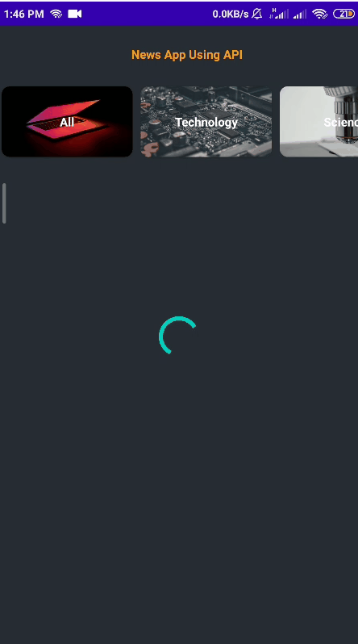

# News_App_API_Retrofit_Picasso

# Android-Studio-Sprints-NAID

 This repositery show my implementations of  android studio projects with Sprints and NAID

<!--   -->

  
     
   
  

## About the Project

This Project is part of the NAID Mobile App Internship hosted and managed by Sprints concerning `Building an News App Using News API`. 

## Tools 
> Retrofit2
> Gson Converter
> Picasso

  

## What has been Done
- Articles & Category Classes.
- Category Recycler View Adapter.
- Category Recycler View Model.
- News Recycler View Adapter.
- News Recycler View Model.
- News Detailed Activity: To show in depth info about the article with redirect to the full article.
- Retrofit API Interface.

The category recycler view works fine and fetch the data correctrly. also passing the category type onClick works fine, but no data was fetched throught the API.\
I also Checked the API URL using **Postman** and it worked and the json was generated with the corresponding fields.

## Problem Encountered
Retrofit2 call.enqueue(new Callback<NewsModel>() is not working and no error in the logcat.\
Always skip `onResponse` and enters `onFailure` only. -> See the GIF in the start of the readme.

 

## Prerequisites

A good Understanding of **Java**, **OOP**  and one of its GUI Components (Android Studio)\
However, you can apply the concepts of the projects with any other prefered programming language.

## Projects List

|  # |                                       Project Name                                       |          Status          |
|:--:|:----------------------------------------------------------------------------------------:|:------------------------:|
| 01 | [LoginForm Design with Linear Layout](https://github.com/mohamed-abdelaziz721/Login-Form) |    :heavy_check_mark:    |
| 02 |          [Relative Layout](https://github.com/mohamed-abdelaziz721/Relative-Layout)          |    :heavy_check_mark:    |
| 03 |          [Constraint Layout](https://github.com/mohamed-abdelaziz721/Constraint-Layout)              |    :heavy_check_mark:    |
| 04 | [Navigation Throught Activities](https://github.com/mohamed-abdelaziz721/Navigation-Throught-Activities)              |    :heavy_check_mark:    |
| 05 | [Accessibility App](https://github.com/mohamed-abdelaziz721/Accessibility-App)              |    :heavy_check_mark:    |
| 06 | [News App using Api](https://github.com/mohamed-abdelaziz721/News_App_API_Retrofit_Picasso)              |   :hourglass_flowing_sand:    |

## Supervision
> Eng. Nourhan Gehad - Sprints - NAID

> Eng. Mohamed Hefney - Sprints - NAID
